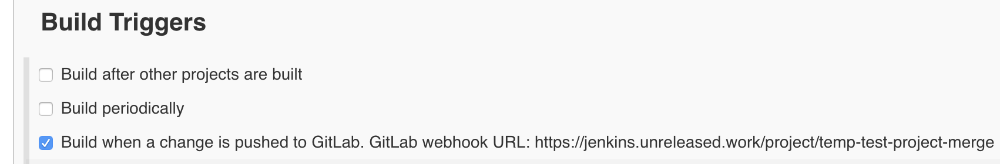
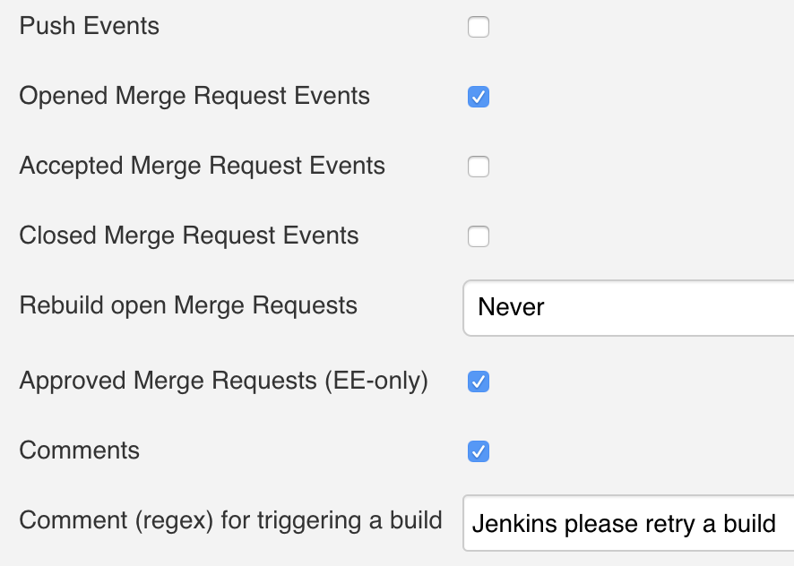
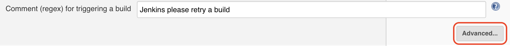
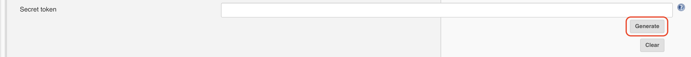
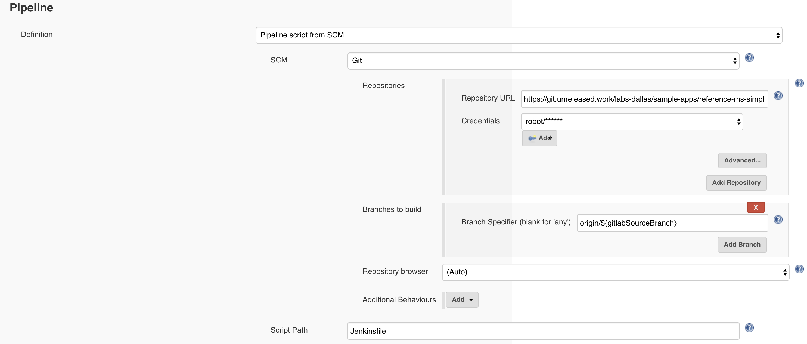
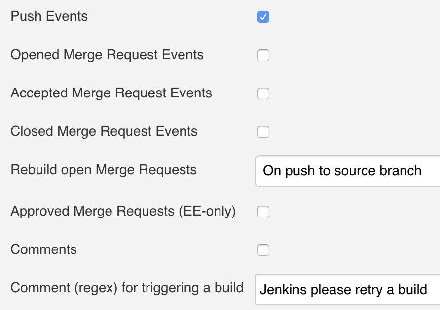
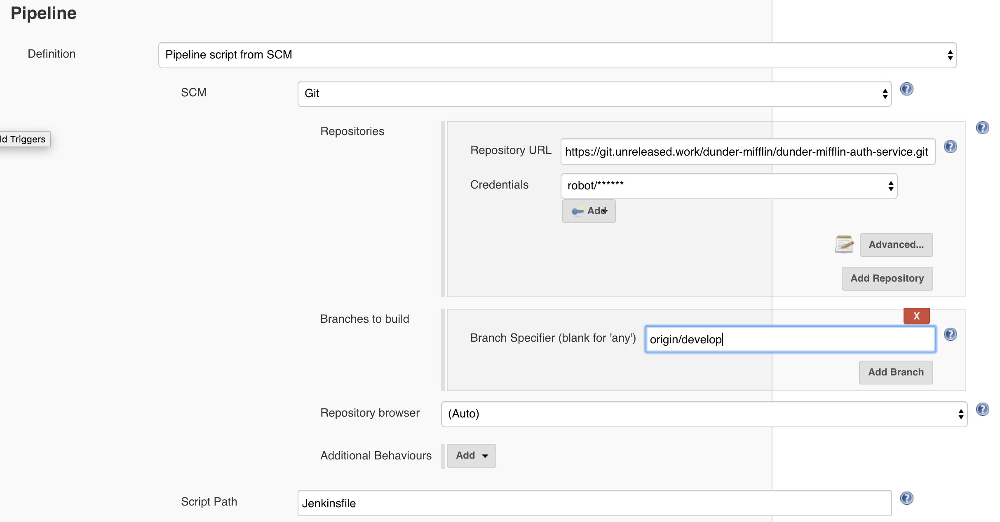
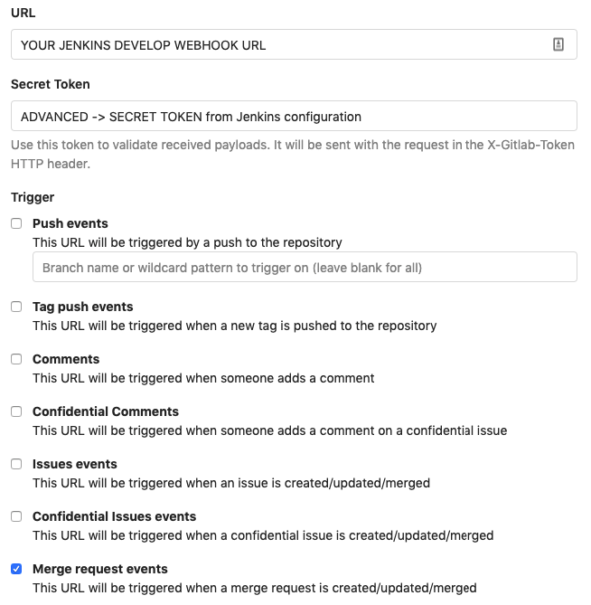
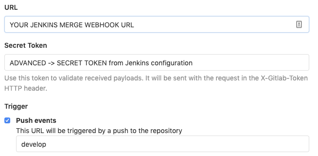

# Jenkins 

**References:** 

* [Jenkins Introduction](https://enablement-bible.cfapps.io/jenkins-intro.html)
* [Jenkins Walkthrough](https://enablement-bible.cfapps.io/jenkins-walkthrough.html)
* [Jenkins User Handbook](https://jenkins.io/doc/book/)

**Table of Contents:**

*	[Jenkins Introduction](#introduction)
*   [Jenkins Walkthrough](#jenkins-walkthrough)
    *   [Merge Pipeline](#merge-pipeline)
    *   [Development Pipeline](#development-pipeline)
    *   [Production Pipeline](#production-pipeline)
	*	[GitLab Webhooks](#gitlab-webhooks)
    *   [Jenkinsfile](#jenkinsfile)

## Introduction

### Getting started with Pipeline

> Jenkins Pipeline is a suite of plugins that supports implementing and integrating continuous delivery pipelines into Jenkins. Pipeline provides an extensible set of tools for modeling simple-to-complex delivery pipelines "as code" via the Pipeline [DSL](https://en.wikipedia.org/wiki/Domain-specific_language).

#### [Defining a Pipeline](https://jenkins.io/doc/book/pipeline/getting-started/#defining-a-pipeline)

> Declarative Pipeline is a [DSL](https://en.wikipedia.org/wiki/Domain-specific_language) to describe portions of your software delivery pipeline. Scripted Pipeline is written in a limited form of Groovy syntax.
> 
> A Pipeline can be created in the following way:
> 
> In SCM - you can write a `Jenkinsfile` manually, which you can commit to your project’s source control repository.
> 
> It is generally considered best practice to define the Pipeline in a `Jenkinsfile` which Jenkins will then load directly from source control.

##### [In SCM](https://jenkins.io/doc/book/pipeline/getting-started/#defining-a-pipeline-in-scm)

> To make this easier, your Pipeline’s `Jenkinsfile` can be written in a text editor or integrated development environment (IDE) and committed to source control (with the application code that Jenkins will build). Jenkins can then check out your `Jenkinsfile` from source control as part of your Pipeline project’s build process and then proceed to execute your Pipeline.
> 
> To configure your Pipeline project to use a `Jenkinsfile` from source control:
> 
> 1.  Follow the procedure above for defining your Pipeline [through the classic UI](https://jenkins.io/doc/book/pipeline/getting-started/#through-the-classic-ui) until you reach step 5 (accessing the Pipeline section on the **Pipeline** configuration page).
>     
> 2.  From the **Definition** field, choose the **Pipeline script from SCM** option.
>     
> 3.  From the **SCM** field, choose the type of source control system of the repository containing your `Jenkinsfile`.
>     
> 4.  Complete the fields specific to your repository’s source control system.
>     
>     *   **Tip:** If you are uncertain of what value to specify for a given field, click its **?** icon to the right for more information.
>         
>     
> 5.  In the **Script Path** field, specify the location (and name) of your `Jenkinsfile`. This location is the one that Jenkins checks out/clones the repository containing your `Jenkinsfile`, which should match that of the repository’s file structure. The default value of this field assumes that your `Jenkinsfile` is named “\`Jenkinsfile\`” and is located at the root of the repository.
>     
> 
> When you update the designated repository, a new build is triggered, as long as the Pipeline is configured with an SCM polling trigger.

##### [Global Variable Reference](https://jenkins.io/doc/book/pipeline/getting-started/#global-variable-reference)

> In addition to the Snippet Generator, which only surfaces steps, Pipeline also provides a built-in "**Global Variable Reference**." Like the Snippet Generator, it is also dynamically populated by plugins. Unlike the Snippet Generator however, the [Global Variable Reference](https://jenkins.unreleased.work/pipeline-syntax/globals#env) only contains documentation for **variables** provided by Pipeline or plugins, which are available for Pipelines.
> 
> The variables provided by default in Pipeline are:
> 
> **env** Environment variables accessible from Scripted Pipeline, for example: `env.PATH` or `env.BUILD_ID`. Consult the built-in [Global Variable Reference](https://jenkins.unreleased.work/pipeline-syntax/globals#env) for a complete, and up to date, list of environment variables available in Pipeline.
> 
> **params** Exposes all parameters defined for the Pipeline as a read-only [Map](http://groovy-lang.org/syntax.html#_maps), for example: `params.MY_PARAM_NAME`.
> 
> **currentBuild** May be used to discover information about the currently executing Pipeline, with properties such as `currentBuild.result`, `currentBuild.displayName`, etc. Consult the built-in [Global Variable Reference](https://jenkins.unreleased.work/pipeline-syntax/globals#env) for a complete, and up to date, list of properties available on `currentBuild`.

##### [Declarative Directive Generator](https://jenkins.io/doc/book/pipeline/getting-started/#directive-generator)

> While the Snippet Generator helps with generating steps for a Scripted Pipeline or for the `steps` block in a `stage` in a Declarative Pipeline, it does not cover the [sections](https://jenkins.io/doc/book/pipeline/syntax#declarative-sections) and [directives](https://jenkins.io/doc/book/pipeline/syntax#declarative-directives) used to define a Declarative Pipeline. The "Declarative Directive Generator" utility helps with that. Similar to the [Snippet Generator](https://jenkins.io/doc/book/pipeline/getting-started/#snippet-generator), the Directive Generator allows you to choose a Declarative directive, configure it in a form, and generate the configuration for that directive, which you can then use in your Declarative Pipeline.
> 
> To generate a Declarative directive using the Declarative Directive Generator:
> 
> 1.  Navigate to the **Pipeline Syntax** link (referenced above) from a configured Pipeline, and then click on the Declarative Directive Generator link in the sidepanel, or go directly to [https://jenkins.unreleased.work/directive-generator/](https://jenkins.unreleased.work/directive-generator/).
>     
> 2.  Select the desired directive in the dropdown menu
>     
> 3.  Use the dynamically populated area below the dropdown to configure the selected directive.
>     
> 4.  Click **Generate Directive** to create the directive’s configuration to copy into your Pipeline.
>     
> 
> The Directive Generator can generate configuration for nested directives, such as conditions inside a `when` directive, but it cannot generate Pipeline steps. For the contents of directives which contain steps, such as `steps` inside a `stage` or conditions like `always` or `failure` inside `post`, the Directive Generator adds a placeholder comment instead. You will still need to add steps to your Pipeline by hand.
> 
> _Jenkinsfile (Declarative Pipeline)_
> 
>     stage('Stage 1') {
>         steps {
>             // One or more steps need to be included within the steps block.
>         }
>     }

#### [Further Reading](https://jenkins.io/doc/book/pipeline/getting-started/#further-reading)

> In the next section, [The Jenkinsfile](https://jenkins.io/doc/book/pipeline/jenkinsfile/), more Pipeline steps will be discussed along with patterns for implementing successful, real-world, Jenkins Pipelines.

# Jenkins Walkthrough

We use three pipeline archetypes:

*   [Merge Pipeline](#merge-pipeline)
    
*   [Development Pipeline](#development-pipeline)
    
*   [Production Pipeline](#production-pipeline)
    

Each of these pipelines is run in a different and unique scenario, and serves a distinct purpose.

## Merge Pipeline

Our **merge** pipelines are designed to:

1.  Validate a **feature** Git branch is valid and trustworthy
    
    *   Project can be built without errors
        
    *   All tests are passing
        
    *   Code coverage meets a chosen criteria
        
    *   No bugs are present
        
    *   No security vulnerabilities are present
        
    *   Duplicate code is zero / at a minimum level
        
    
2.  Send a message back to GitLab to accept the merge request
    

### Creating and Configuring Merge Pipeline

#### Creating Merge Pipeline

1.  Login to Jenkins ([https://jenkins.unreleased.work](https://jenkins.unreleased.work))
    
2.  In the top-left of Jenkins, click the [`New Item`](https://jenkins.unreleased.work/view/all/newJob) button
    
3.  For the name of the pipeline, use _name-of-project**\-merge**_
    
    *   _Example:_ If your project’s name is `my-service`, then the merge pipeline should be named `my-service-merge`
        
    
4.  Click `Pipeline` for the job type and then click `Ok`
    

#### Configuring Merge Pipeline

*   In the configuration page, go to the `Build Triggers` section
    
*   Select the `Build when a change is pushed to GitLab..` option  
    

*   Deselect the `Push Events` option in the `Enabled GitLab triggers` section
    
*   Ensure the `Opened Merge Request Events` option is selected
    

*   Click the `Advanced..` button in the `Enabled GitLab triggers` section
    

*   In the `Enable GitLab triggers` → `Advanced` section, find the `Secret token` field and click `Generate`
    

*   In the configuration page, go to the `Pipeline` section
    
*   Enter the following values:
    
    *   `Definition` : `Pipeline script from SCM`
        
    *   `Repository URL` : the URL to your GitLab repository
        
    *   `Credentials` : `robot/******`
        
    *   `Branch Specifier` : `origin/${gitlabSourceBranch}`
        
        *   This ensures that the Git branch specified in the GitLab merge is the one built
            
    *   `Script Path` : `Jenkinsfile`
        
        *   Unless your `Jenkinsfile` has a different name)

## Development Pipeline

Our **development** pipelines are designed to:

1.  Deploy microservice into our development environment using the particular deployment method
    
    *   For library artifacts (library JARs, etc.), this pipeline will _deliver_ into a _snapshot_ repository, not _deploy_

#### Creating Develop Pipeline

1.  Login to Jenkins ([https://jenkins.unreleased.work](https://jenkins.unreleased.work))
    
2.  In the top-left of Jenkins, click the [`New Item`](https://jenkins.unreleased.work/view/all/newJob) button
    
3.  For the name of the pipeline, use _name-of-project**\-develop**_
    
    *   _Example:_ If your project’s name is `my-service`, then the merge pipeline should be named `my-service-develop`
        
    
4.  Click `Pipeline` for the job type and then click `Ok`
    

#### Configuring Develop Pipeline

*   In the configuration page, go to the `Build Triggers` section
    
*   Select the `Build when a change is pushed to GitLab..` option  
    

*   Select the `Push Events` option in the `Enabled GitLab triggers` section
    
*   Deselect the other `Enabled GitLab triggers` option
    

*   Click the `Advanced..` button in the `Enabled GitLab triggers` section
    

*   In the `Enable GitLab triggers` → `Advanced` section, find the `Secret token` field and click `Generate`
    

*   In the configuration page, go to the `Pipeline` section
    
*   Enter the following values:
    
    *   `Definition` : `Pipeline script from SCM`
        
    *   `Repository URL` : the URL to your GitLab repository
        
    *   `Credentials` : `robot/******`
        
    *   `Branch Specifier` : `origin/develop`
        
        *   This ensures that the Git branch specified in the GitLab merge is the one built
  
    *   `Script Path` : `Jenkinsfile`
        
        *   Unless your `Jenkinsfile` has a different name)

        
## Production Pipeline

Our **production** pipelines are designed to:

1.  Deploy microservice into our production environment using the particular deployment method
    
    *   For library artifacts (library JARs, etc.), this pipeline will _deliver_ into a _release_ repository, not _deploy_
        
## GitLab Webhooks

Webhooks can be used for binding events when something is happening within the project. They trigger Jenkins to excute the pipelines when a change is made to GitLab repositories, i.e. when a merge request or a push event are made.

##### Setting up Webhooks:

1. On GitLab project, go to setting - integrations

1. Provide the URL to the Jenkins job

1. Provide the secret token generated from the Jenkins job.

1. Choose the trigger event:

	* #### Merge request events for Merge Pipeline

		
	
	* #### Push events for Develop Pipeline

		

1. Leave the SSL verification enabled.

## Jenkinsfile

We use one `Jenkinsfile` that contains instructions for all three pipelines mentioned in this document. Using Jenkins `when` closures, we are able to create pipeline `steps` that are _do not run_ or _only run_ on certain Git branches.

### Example

The following are examples of a `build.gradle`, `gradle.properties`, and a `Jenkinsfile` that follow our principles.

*   Example `build.gradle`

		buildscript {
			repositories {
				maven {
					url 'https://repository.unreleased.work/repository/maven-releases'
				}
			}
			dependencies {
				classpath 'com.cognizant.cde:gitlab-merge-gradle-plugin:1.0.0'
			}
		}

		apply plugin: com.cognizant.cde.GitlabMergeVerificationPlugin

		verifyMergeRequest {
			gitlabUrl = GITLAB_URL
			gitlabApiToken = API_TOKEN
			gitlabProjectId = PROJECT_ID
			gitlabMergeId = MERGE_ID
		}
    
*   Example `gradle.properties`

		## GitLab Merge Plugin
		GITLAB_URL=https://git.unreleased.work
		API_TOKEN=abcd
		PROJECT_ID=123
		MERGE_ID=placeholder_valu
    
*   Example `Jenkinsfile`

		// Send message to GitLab
		updateGitlabCommitStatus state: 'pending'

		pipeline {
			// Allow this pipeline to run on any Jenkins executor
			agent any

			options {
				// Specify which GitLab instance to use (git.unreleased.work)
				gitLabConnection('gitlab')
			}

			environment {
				// Grab Cloud Foundry credentials, needed for deployments
				CF = credentials('pws-credentials')

				// Grab Nexus credentials, needed for deliveries
				NEXUSCRED = credentials('472bcc5d-035b-44a9-9fda-d6e6a9f22f05')

				// This helps us make sure our pipelines run the appropriate stages
				DEVELOP_BRANCH = 'origin/develop'.equals(env.GIT_BRANCH)
				MASTER_BRANCH = 'origin/master'.equals(env.GIT_BRANCH)
				FEATURE_BRANCH = "${!(env.DEVELOP_BRANCH || env.MASTER_BRANCH)}"
			}

			stages {
				// Verify that the feature branch is not behind develop
				stage('check-for-rebase-before') {
					when {
						expression {
							return env.FEATURE_BRANCH == 'true'
						}
					}
					steps {
						script {
							try {
								sh "./gradlew clean verifyMergeRequest -PMERGE_ID=$env.gitlabMergeRequestIid"
								updateGitlabCommitStatus name: 'check-for-rebase', state: 'success'
							} catch (exc) {
								// this is so we can capture the results in 'finally' below
								updateGitlabCommitStatus name: 'check-for-rebase', state: 'failed'
								throw exec
							}
						}
					}
				}

				stage('build') {
					steps {
						updateGitlabCommitStatus state: 'running'
					}
				}

				stage('unit-test') {
					when {
						expression {
							return env.FEATURE_BRANCH == 'true'
						}
					}
					steps {
						script {
							try {
								sh './gradlew test'
								updateGitlabCommitStatus name: 'unit test', state: 'success'
							} catch (exc) {
								// this is so we can capture the results in 'finally' below
								updateGitlabCommitStatus name: 'unit test failed', state: 'failed'
								throw exec
							} finally {
								junit '**/build/test-results/test/*.xml'
							}
						}
					}
				}

				stage('integration-test') {
					when {
						expression {
							return env.FEATURE_BRANCH == 'true'
						}
					}
					steps {
						script {
							try {
								sh './gradlew integrationTest'
								updateGitlabCommitStatus name: 'integration test', state: 'success'
							} catch (exc) {
								// this is so we can capture the results in 'finally' below
								updateGitlabCommitStatus name: 'integration test failed', state: 'failed'
								throw exec
							} finally {
								junit '**/build/test-results/integrationTest/*.xml'
							}
						}
					}
				}

				stage('sonar') {
					when {
						expression {
							return env.FEATURE_BRANCH == 'true'
						}
					}
					steps {
						script {
							withSonarQubeEnv('Sonar_GCP') {
								sh """
								   ./gradlew check jacocoTestCoverageVerification sonar -Dsonar.host.url=https://sonar.unreleased.work -Dsonar.projectName='cm-price-history-ms' -Dsonar.branch=${
									env.GIT_BRANCH
								}
								   """
								updateGitlabCommitStatus name: 'price history MS sonar', state: 'success'
							}
						}
					}
				}

				stage("Quality Gate") {
					when {
						expression {
							return env.FEATURE_BRANCH == 'true'
						}
					}
					steps {
						script {
							timeout(time: 5, unit: 'MINUTES') {
								waitForQualityGate abortPipeline: true
							}

						}
					}
				}

				// Verify again that the feature branch is still not behind develop
				stage('check-for-rebase-after') {
					when {
						expression {
							return env.FEATURE_BRANCH == 'true'
						}
					}
					steps {
						script {
							try {
								sh "./gradlew verifyMergeRequest -PMERGE_ID=$env.gitlabMergeRequestIid"
								updateGitlabCommitStatus name: 'check-for-rebase', state: 'success'
							} catch (exc) {
								// this is so we can capture the results in 'finally' below
								updateGitlabCommitStatus name: 'check-for-rebase', state: 'failed'
								throw exec
							}
						}
					}
				}

				stage("merge-code") {
					when {
						expression {
							return env.FEATURE_BRANCH == 'true'
						}
					}
					steps {
						acceptGitLabMR()
					}
				}

				stage('deploy-develop') {
					when {
						expression {
							return env.DEVELOP_BRANCH == 'true'
						}
					}
					steps {
						sh '''
						   ./gradlew -PCF_USR=$CF_USR -PCF_PSW=$CF_PSW -PCF_SPACE="curriculum-development" cf-push
						   '''
						updateGitlabCommitStatus name: 'cf-push', state: 'success'
					}
				}
			}

			post {
				always {
					// This deletes the workspace so that jenkins does not run out of memory
					deleteDir()
				}
				success {
					updateGitlabCommitStatus state: 'success'
				}
				failure {
					updateGitlabCommitStatus state: 'failed'
				}
			}
		}