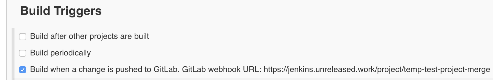
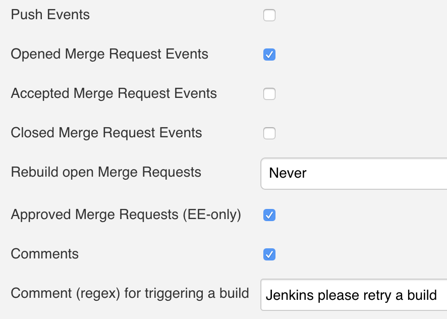
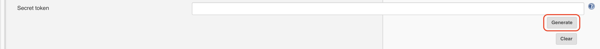
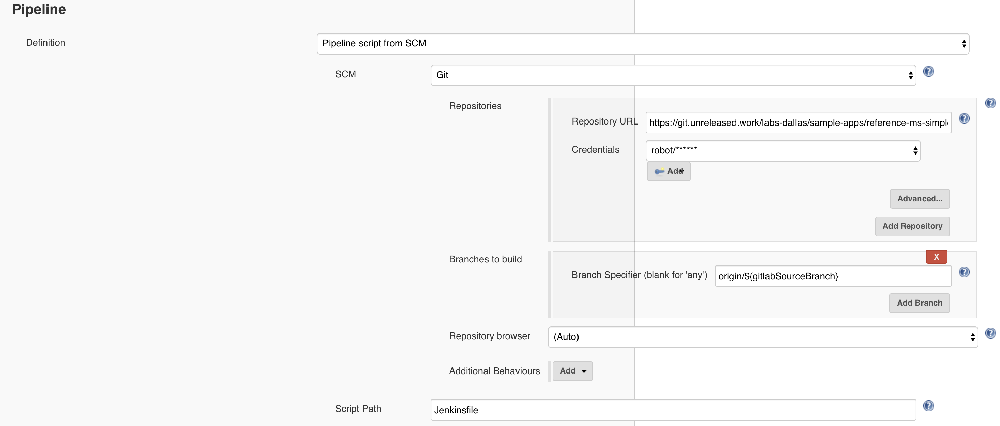
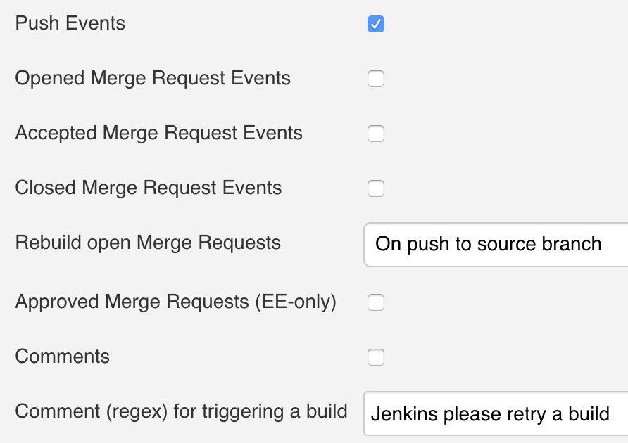
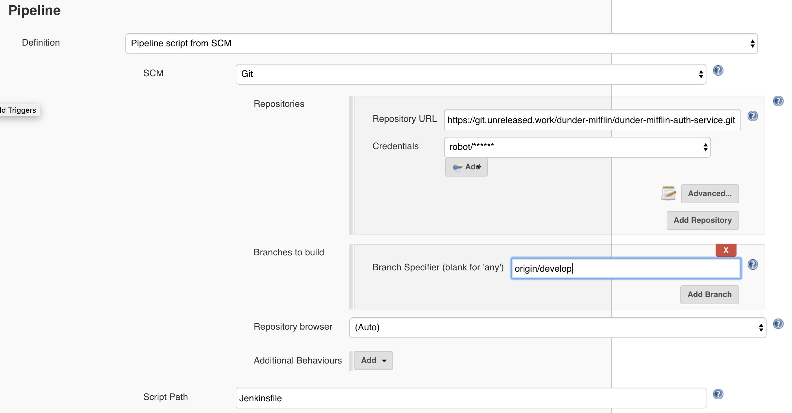
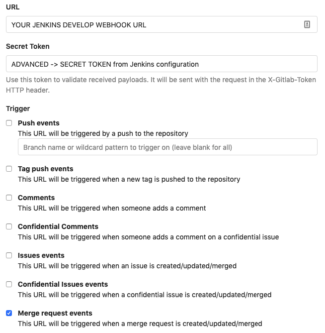
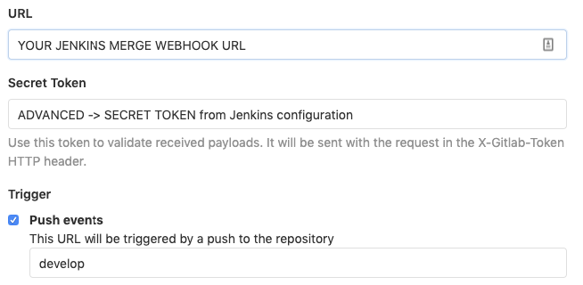

# Jenkins 

**References:** 

* Enablement Bible
* [Jenkins User Handbook](https://jenkins.io/doc/book/)

**Table of Contents:**

*   [Jenkins Walkthrough](#jenkins-walkthrough)
    *   [Merge Pipeline](#merge-pipeline)
    *   [Development Pipeline](#development-pipeline)
    *   [Production Pipeline](#production-pipeline)
	*	[GitLab Webhooks](#gitlab-webhooks)
    *   [Jenkinsfile](#jenkinsfile)

# Jenkins Walkthrough

We use three pipeline archetypes:

*   [Merge Pipeline](#merge-pipeline)
    
*   [Development Pipeline](#development-pipeline)
    
*   [Production Pipeline](#production-pipeline)
    

Each of these pipelines is run in a different and unique scenario, and serves a distinct purpose.

## Merge Pipeline

Our **merge** pipelines are designed to:

1.  Validate a **feature** Git branch is valid and trustworthy
    
    *   Project can be built without errors
        
    *   All tests are passing
        
    *   Code coverage meets a chosen criteria
        
    *   No bugs are present
        
    *   No security vulnerabilities are present
        
    *   Duplicate code is zero / at a minimum level
        
    
2.  Send a message back to GitLab to accept the merge request
    

### Creating and Configuring Merge Pipeline

#### Creating Merge Pipeline

1.  Login to Jenkins ([https://jenkins.unreleased.work](https://jenkins.unreleased.work))
    
2.  In the top-left of Jenkins, click the [`New Item`](https://jenkins.unreleased.work/view/all/newJob) button
    
3.  For the name of the pipeline, use _name-of-project**\-merge**_
    
    *   _Example:_ If your project’s name is `my-service`, then the merge pipeline should be named `my-service-merge`
        
    
4.  Click `Pipeline` for the job type and then click `Ok`
    

#### Configuring Merge Pipeline

*   In the configuration page, go to the `Build Triggers` section
    
*   Select the `Build when a change is pushed to GitLab..` option  
    

*   Deselect the `Push Events` option in the `Enabled GitLab triggers` section
    
*   Ensure the `Opened Merge Request Events` option is selected
    

*   Click the `Advanced..` button in the `Enabled GitLab triggers` section
    

*   In the `Enable GitLab triggers` → `Advanced` section, find the `Secret token` field and click `Generate`
    

*   In the configuration page, go to the `Pipeline` section
    
*   Enter the following values:
    
    *   `Definition` : `Pipeline script from SCM`
        
    *   `Repository URL` : the URL to your GitLab repository
        
    *   `Credentials` : `robot/******`
        
    *   `Branch Specifier` : `origin/${gitlabSourceBranch}`
        
        *   This ensures that the Git branch specified in the GitLab merge is the one built
            
    *   `Script Path` : `Jenkinsfile`
        
        *   Unless your `Jenkinsfile` has a different name)

## Development Pipeline

Our **development** pipelines are designed to:

1.  Deploy microservice into our development environment using the particular deployment method
    
    *   For library artifacts (library JARs, etc.), this pipeline will _deliver_ into a _snapshot_ repository, not _deploy_

#### Creating Develop Pipeline

1.  Login to Jenkins ([https://jenkins.unreleased.work](https://jenkins.unreleased.work))
    
2.  In the top-left of Jenkins, click the [`New Item`](https://jenkins.unreleased.work/view/all/newJob) button
    
3.  For the name of the pipeline, use _name-of-project**\-develop**_
    
    *   _Example:_ If your project’s name is `my-service`, then the merge pipeline should be named `my-service-develop`
        
    
4.  Click `Pipeline` for the job type and then click `Ok`
    

#### Configuring Develop Pipeline

*   In the configuration page, go to the `Build Triggers` section
    
*   Select the `Build when a change is pushed to GitLab..` option  
    

*   Select the `Push Events` option in the `Enabled GitLab triggers` section
    
*   Deselect the other `Enabled GitLab triggers` option
    

*   Click the `Advanced..` button in the `Enabled GitLab triggers` section
    

*   In the `Enable GitLab triggers` → `Advanced` section, find the `Secret token` field and click `Generate`
    

*   In the configuration page, go to the `Pipeline` section
    
*   Enter the following values:
    
    *   `Definition` : `Pipeline script from SCM`
        
    *   `Repository URL` : the URL to your GitLab repository
        
    *   `Credentials` : `robot/******`
        
    *   `Branch Specifier` : `origin/develop`
        
        *   This ensures that the Git branch specified in the GitLab merge is the one built
  
    *   `Script Path` : `Jenkinsfile`
        
        *   Unless your `Jenkinsfile` has a different name)

        
## Production Pipeline

Our **production** pipelines are designed to:

1.  Deploy microservice into our production environment using the particular deployment method
    
    *   For library artifacts (library JARs, etc.), this pipeline will _deliver_ into a _release_ repository, not _deploy_
        
## GitLab Webhooks

Webhooks can be used for binding events when something is happening within the project. They trigger Jenkins to excute the pipelines when a change is made to GitLab repositories, i.e. when a merge request or a push event are made.

##### Setting up Webhooks:

1. On GitLab project, go to setting - integrations

1. Provide the URL to the Jenkins job

1. Provide the secret token generated from the Jenkins job.

1. Choose the trigger event:

	* #### Merge request events for Merge Pipeline

		
	
	* #### Push events for Develop Pipeline

		

1. Leave the SSL verification enabled.

## Jenkinsfile

We use one `Jenkinsfile` that contains instructions for all three pipelines mentioned in this document. Using Jenkins `when` closures, we are able to create pipeline `steps` that are _do not run_ or _only run_ on certain Git branches.

### Example

The following are examples of a `build.gradle`, `gradle.properties`, and a `Jenkinsfile` that follow our principles.

*   Example `build.gradle`

		buildscript {
			repositories {
				maven {
					url 'https://repository.unreleased.work/repository/maven-releases'
				}
			}
			dependencies {
				classpath 'com.cognizant.cde:gitlab-merge-gradle-plugin:1.0.0'
			}
		}

		apply plugin: com.cognizant.cde.GitlabMergeVerificationPlugin

		verifyMergeRequest {
			gitlabUrl = GITLAB_URL
			gitlabApiToken = API_TOKEN
			gitlabProjectId = PROJECT_ID
			gitlabMergeId = MERGE_ID
		}
    
*   Example `gradle.properties`

		## GitLab Merge Plugin
		GITLAB_URL=https://git.unreleased.work
		API_TOKEN=abcd
		PROJECT_ID=123
		MERGE_ID=placeholder_valu
    
*   Example `Jenkinsfile`

		// Send message to GitLab
		updateGitlabCommitStatus state: 'pending'

		pipeline {
			// Allow this pipeline to run on any Jenkins executor
			agent any

			options {
				// Specify which GitLab instance to use (git.unreleased.work)
				gitLabConnection('gitlab')
			}

			environment {
				// Grab Cloud Foundry credentials, needed for deployments
				CF = credentials('pws-credentials')

				// Grab Nexus credentials, needed for deliveries
				NEXUSCRED = credentials('472bcc5d-035b-44a9-9fda-d6e6a9f22f05')

				// This helps us make sure our pipelines run the appropriate stages
				DEVELOP_BRANCH = 'origin/develop'.equals(env.GIT_BRANCH)
				MASTER_BRANCH = 'origin/master'.equals(env.GIT_BRANCH)
				FEATURE_BRANCH = "${!(env.DEVELOP_BRANCH || env.MASTER_BRANCH)}"
			}

			stages {
				// Verify that the feature branch is not behind develop
				stage('check-for-rebase-before') {
					when {
						expression {
							return env.FEATURE_BRANCH == 'true'
						}
					}
					steps {
						script {
							try {
								sh "./gradlew clean verifyMergeRequest -PMERGE_ID=$env.gitlabMergeRequestIid"
								updateGitlabCommitStatus name: 'check-for-rebase', state: 'success'
							} catch (exc) {
								// this is so we can capture the results in 'finally' below
								updateGitlabCommitStatus name: 'check-for-rebase', state: 'failed'
								throw exec
							}
						}
					}
				}

				stage('build') {
					steps {
						updateGitlabCommitStatus state: 'running'
					}
				}

				stage('unit-test') {
					when {
						expression {
							return env.FEATURE_BRANCH == 'true'
						}
					}
					steps {
						script {
							try {
								sh './gradlew test'
								updateGitlabCommitStatus name: 'unit test', state: 'success'
							} catch (exc) {
								// this is so we can capture the results in 'finally' below
								updateGitlabCommitStatus name: 'unit test failed', state: 'failed'
								throw exec
							} finally {
								junit '**/build/test-results/test/*.xml'
							}
						}
					}
				}

				stage('integration-test') {
					when {
						expression {
							return env.FEATURE_BRANCH == 'true'
						}
					}
					steps {
						script {
							try {
								sh './gradlew integrationTest'
								updateGitlabCommitStatus name: 'integration test', state: 'success'
							} catch (exc) {
								// this is so we can capture the results in 'finally' below
								updateGitlabCommitStatus name: 'integration test failed', state: 'failed'
								throw exec
							} finally {
								junit '**/build/test-results/integrationTest/*.xml'
							}
						}
					}
				}

				stage('sonar') {
					when {
						expression {
							return env.FEATURE_BRANCH == 'true'
						}
					}
					steps {
						script {
							withSonarQubeEnv('Sonar_GCP') {
								sh """
								   ./gradlew check jacocoTestCoverageVerification sonar -Dsonar.host.url=https://sonar.unreleased.work -Dsonar.projectName='cm-price-history-ms' -Dsonar.branch=${
									env.GIT_BRANCH
								}
								   """
								updateGitlabCommitStatus name: 'price history MS sonar', state: 'success'
							}
						}
					}
				}

				stage("Quality Gate") {
					when {
						expression {
							return env.FEATURE_BRANCH == 'true'
						}
					}
					steps {
						script {
							timeout(time: 5, unit: 'MINUTES') {
								waitForQualityGate abortPipeline: true
							}

						}
					}
				}

				// Verify again that the feature branch is still not behind develop
				stage('check-for-rebase-after') {
					when {
						expression {
							return env.FEATURE_BRANCH == 'true'
						}
					}
					steps {
						script {
							try {
								sh "./gradlew verifyMergeRequest -PMERGE_ID=$env.gitlabMergeRequestIid"
								updateGitlabCommitStatus name: 'check-for-rebase', state: 'success'
							} catch (exc) {
								// this is so we can capture the results in 'finally' below
								updateGitlabCommitStatus name: 'check-for-rebase', state: 'failed'
								throw exec
							}
						}
					}
				}

				stage("merge-code") {
					when {
						expression {
							return env.FEATURE_BRANCH == 'true'
						}
					}
					steps {
						acceptGitLabMR()
					}
				}

				stage('deploy-develop') {
					when {
						expression {
							return env.DEVELOP_BRANCH == 'true'
						}
					}
					steps {
						sh '''
						   ./gradlew -PCF_USR=$CF_USR -PCF_PSW=$CF_PSW -PCF_SPACE="curriculum-development" cf-push
						   '''
						updateGitlabCommitStatus name: 'cf-push', state: 'success'
					}
				}
			}

			post {
				always {
					// This deletes the workspace so that jenkins does not run out of memory
					deleteDir()
				}
				success {
					updateGitlabCommitStatus state: 'success'
				}
				failure {
					updateGitlabCommitStatus state: 'failed'
				}
			}
		}