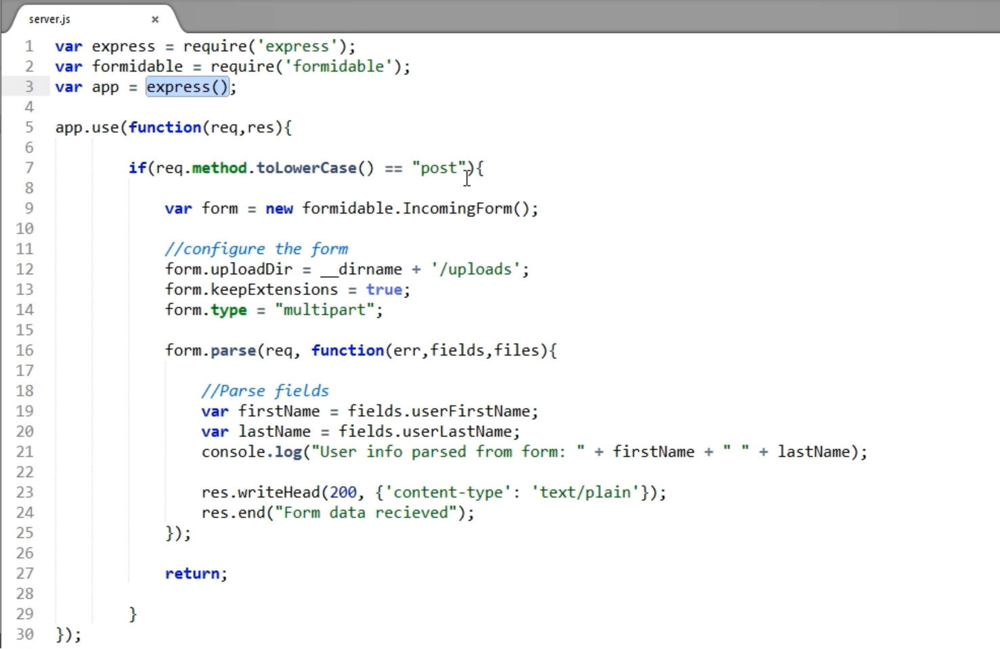

# Node.js

Node.js is a server side framework built on Google Chrome's Javascript runtime, or a stand alone Javascript environment where we can excute Javascript without a browser.

**Table of Content:**

* [Installation](#installation)
	* [Testing and Verifying](#testing-and-verifying)
	* [Managing Node versions](#managing-node-versions)
	* [Excuting a Node (.JS) file](#excuting-a-node-js-file)
* [Node.js Syntax](#nodejs-syntax)
	* [Features](#features)
	* [Modules](#modules)
		* [Writing Modules](#writing-modules)
		* [NPM modules](#npm-modules)
		* [Community Modules](#community-modules)
		* [NPM Package Management](#npm-package-management)
* [Creating a Basic Web Server using the HTTP Module](#creating-a-basic-web-server-using-the-http-module)
	* [Creating an HTTP server](#creating-an-http-server)
	* [Processing Requests](#processing-requests)
	* [Sending Responses](#sending-responses)
	* [Managing Events](#managing-events)
	* [Serving an HTML file](#serving-an-html-file)
	* [Creating a Node.js HTTP Client Application](#creating-a-nodejs-http-client-application)
	* [Managing Client GET Requests](#managing-client-get-requests)
	* [Managing Client POST Requests](#managing-client-post-requests)
	* [Parsing URLs](#parsing-urls)
	* [Working with Query Strings](#working-with-query-strings)
* [Read more...](#read-more)

## Installation

From [Node.js website](https://nodejs.org).

### Testing and Verifying

Check the version using `$ node -v` on the CMD, or `$ node --version`

By typing `node` on CMD, we are able to excute Javascript from CMD using REPL (Read Eval Print Loop).

	> node;
	> console;
	> var a = 12;
	> console.log(process.version);

### Managing Node versions

To install an older version of Node.js (for testing purposes), we can install `nvmw` by `$ npm install -g nvmw`

Then, `$ nvmw install v0.10.26`

Finally, `$ nvmw use v0.10.26`

*This is only valid for the CMD shell where this command was excuted from.*

To deactivate, `$ nvmw deactivate`

To see all installed versions, `$ nvmw ls`

### Excuting a Node (.JS) file

Simply type `$ node fileName.js` on the CMD shell.

## Node.js Syntax

### Features

* Loose Typing & Type Coercion
* Prototypes, to define custom objects (constructor functions - manufacturers)
* Access to `global` & `process` objects
* Access to `require` function
* Doesn't have browser specific objects, such as `window` and `document`.

## Modules

* Basic Javascript `require` and `exports` can be used to handle modules in Node.js

* `module.exports` can also be used:

		module.exports = function() {
			// Valid Javascript code
			}

	Then, import as:
	
		var myModule = require(#Module relative path)

### Writing Modules

Node.js cache modules when they are used for first time. Using `require()` keyword twice on the same file would only result in importing the module first time, then getting it from cache the second time.

*Note: using the `var` keyword makes the variable only available locally to the module.*

### NPM modules

Also known as *Core Modules*. [Documentation](https://nodejs.org/api/modules.html)

To use a core module, we can simply declare them as variables on our code:

	var os = require('os');
	console.log(os);
	console.log(os.platform());
	
Where `os` is the name of the core module.
	
Another important core module is `http`

	var http = require('http');
	console.log(http);
	
### Community Modules

[List of Node Packaged Modules](https://docs.npmjs.com/)

To install a package, `$ npm install moduleName --save`.

* The `--save` flag will add the package to the list of dependencies on the `package.json`.

When we use the `require('moduleName')` without disgnating the path to module, Node first looks for that module in Node's core modules, if not found it looks for it in the `node_modules` folder.

To install all dependencies included in the `package.json`, we use the `$ npm install` command.

### NPM Package Management

* To initialize a project, we can use `$ npm init` and follow the prompts. This command will automatically generate the `package.json` file.

	*Note: "entry point" is the main `.js` file.*

* To use modules, we can use `$ npm install moduleName --save`.

	*Note: to install modules globally we can use the `-g` flag.*
	
* To install all dependencies in the `package.json` file, we can use `$ npm install`.

* To ensure we have the latest version of a module, we can add the carrot symbol `^` before the dependency version in `package.json` to indicate "selected version or higher". Then, we can use the `$ npm update` command to update dependencies with `^`s.

* To delete a module, remove the dependency from `package.json` then use `$ npm prune` command.

## Creating a Basic Web Server using the HTTP Module

### Creating an HTTP server

1. Use `http` core module.

		var http = require('http');
		
1. Add a method to handle all requests.

		var handlerMethod = function(req, res){
			res.end("A simple response from a web server");
		}

1. Create the server.

		http.createServer(handlerMethod).listen(3456,'localhost');
		
1. Test the server.

		console.log("HTTP Server Listening");

	* visit: localhost:3456 to see the response.
	
### Processing Requests

Two helpful modules that we can use to handle requests:

	"dependencies": {
		"connect":"*",
		"body-parser":"*"
	}

Note: `*` is used to indicate "install latest version".

**Connect** is used to add functionality easily to the HTTP server in the form of plugins.
 **body-parser** is used to get easy access to form fields on requests.

1. Install dependencies using `$ npm install`.

1. define `index.js`, the entry point to the Node app:

		var http = require('http');
		var connect = require('connect');
		var bodyParser = require('body-parser');
		
1. Setup app using connect module:

		var app = connect()
			.use(bodyParser.urlencoded(
				{extende:true}
			))
			.use(function(req,res){
				var parsedInfo = {};
				
				parsedInfo.firstName = req.body.userFirstName;
				parsedInfo.lastName = req.body.userLastName;
				
				res.end("User info from form: " + parsedInfo.firstName + " " + parsedInfo.lastName)
			});

1. Setup the server:
		http.createServer(app).listen(3456,'localhost');

1. Run App:

	`$ node index.js`

### Sending Responses

To customize response:

	var app = connect()
		.use(function(req,res){
			
			if(req.url == "/hello"){
				console.log("Sending Plain");
				res.end("Hello from App");
			} else if (req.url == "/hello.json"){
				console.log("Sending JSON");
				var data = "Hello";
				var jsonData = JSON.stringify(data);
				res.setHeader('Content-Type','application/json');
				res.end(jsonData);
			} else if(req.url == "/statusCodeDemo"){
				console.log("Sending 404 Status code");
				res.statusCode = 404;
				res.end("Oops, could not find something");
			}
			
		})
		.listen(3456);
		

*Note: `Connect` uses `http` core module by default, so we don't have to explicitly import it.

### Managing Events

1. Setup the server:

		var server = http.createServer();

1. Listen to the `request` event:

		server.on('request', function(req, res){
			console.log(req.headers);
			res.end("Thanks, I got the request.");
		});

1. Listen to the `upgrade` event:

		server.on('upgrade', function(req, socket, head){
			console.log("Upgrade the connection, usually is done by 3rd parties.");
		});

1. Listen to port:

		server.listen(3456,function(){
			console.log("HTTP SERVER LISTENING");
		});

### Serving an HTML file

1. Add dependencies to `package.json`:

		"dependencies":{
			"connect":"*",
			"serve-static":"*"
		}
		
1. Import modules:

		var connect = require('connect');
		var serveStatic = require('serve-static');

1. Create the App:

		var app = connect()
			// Must use serveStatic first
			.use(serveStatic('myPublicFolder'))
			.use(function(req, res){
				res.end("Some message");
			})
			.listen(3456);
			
		console.log("LISTENING AT PORT 3456");
		
### Creating a Node.js HTTP Client Application

1. Add `request` module as a dependency:

		"dependencies":{
			"request":"*"
		}

1. import the dependency to `index.js`:

		var request = require('request');

1. Use the module:

		request('http://www.x.com', function(error, response, body){
			
			if(!error && response.statusCode == 200 ){
				console.log(body);
			}

			if(error){
				console.log(error);
			}
		});

1. Run the application, `$ node index.js`.

### Managing Client GET Requests

1. Setup and import the dependencies:

		var request = require('request');
		var fs = require('fs');
		
1. Build the request:

		request("someUrl", function(error, response, body){
		
			if(error){
				console.log(error);
			}
			
			console.log(response.body);
			console.log(response.statusCode);
			console.log(response.headers);
		});
		
1. To write the response to a txt file we can add the following method to the `request()` call using `fs` core module:

		.pipe(fs.createWriteStream('DemoData/pipedFile.txt'));
		
1. To customize headers, we create an options object:

		var options = {
			url: "someUrl",
			headers: {"X-DEMO-HEADERS":"myDemoHeader"}
		}
		
1. Building the new request:

		var callback = function(error, response, body){
			if(error) console.log(error);
			else console.log(body);
		}
		
		request(options, callback);

### Managing Client POST Requests

**The server setup:**

Also, add `app.listen(3456);` 

**The Client setup:**

1. Import modules:

		var request = require('request');
		var fs = require('fs');
		
1. Build request body:

		var data = {
			userFirstName: "John",
			userLastName: "Doe"
		}

1. Build the Http request:

		request.post('someUrl').form(data);
		
1. Handle the response: 

		var callback = function(error, response, body){
			if(error) console.log(error);
			else console.log(body);
		}
		
1. Adjust the Http request:

		request.post('someUrl', {form:data}, callback)

1. Creating a post request to upload files - adjusting data:

		var data = {
			userFirstName: "John",
			userLastName: "Doe",
			myBuffer: new Buffer([1]), //Buffer for passing file data
			myFile: fs.createReadStream(__dirname + '/images/spinach,jpg')
		}
		
1. Adjust Http request:

		request.post({url:'someUrl', formData: data}, function optionalCallback(err, response, body){
			if(err){
				return console.error('Message');
			}
			console.log('File Uploaded to Server');
		})
		
### Parsing URLs

1. Import the `url` core module:

		var url = require('url');
		
1. Declaring a testUrl:

		var testUrl = "Some Very Long Full of Queries Url";
		
1. Parse it using the `url` module:

		var parsedUrlObject = url.parse(testUrl, true);
		// Second property is optional and used to further parsing. 

1. To create a URL from a parsed URL object:

		var urlString = url.format(parsedUrlObject);	

### Working with Query Strings

1. Add the `querystring` module to `package.json`:

		"dependencies":{
			"querystring":"*"
		}
		
1. Import the module:

		var queryString = require('queryString');
		
1. Append Queries to a Url

		var testBaseUrl = "SomeUrl";
		
		var queryDataObject = {
			'resourceID':'1',
			'username':'andy'
		}
		
		// Only first argument is required, others are used for defining separators
		var stringFromObject = queryString.stringify(queryDataObject,";",":");
		
		console.log(testBaseUrl + "?" + stringFromObject);

## Read More

* [The NodeSource Blog](https://nodesource.com/blog/)
* [InfoWorld Magazine](https://www.infoworld.com/category/node-js/)