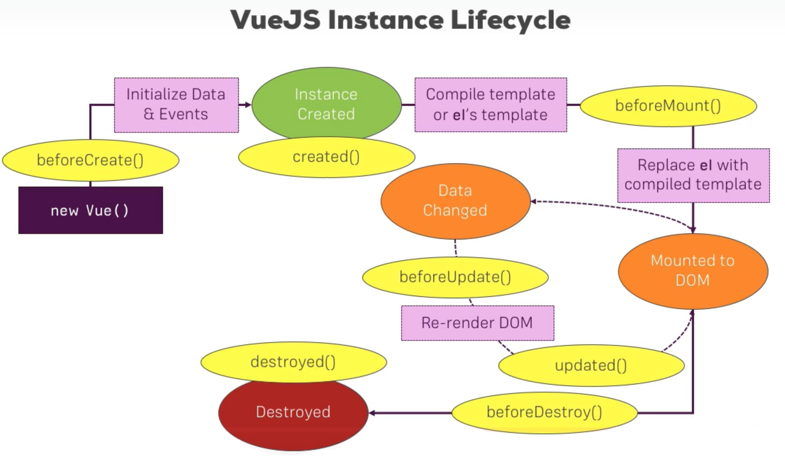
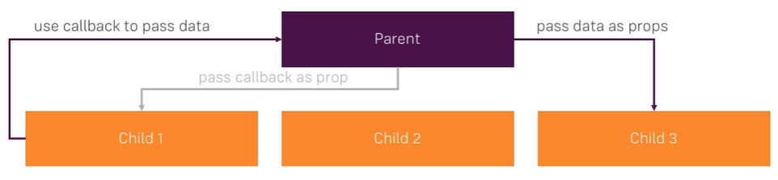

# Vue.js Notes

# Getting Started

**Documentation**: [Vue.js Official Guide](https://vuejs.org/v2/guide/) - [Vue API](https://vuejs.org/v2/api)

## Vue CLI

**Documentation**: [Vue CLI Guide](https://cli.vuejs.org/guide/)

`npm install -g @vue/cli` to **install Vue CLI** using npm.

`npm install -g @vue/cli @vue/cli-service-global`, to **install the CLI-service-global plugin**. This allows for [instant prototyping, which isn't recommended for large-scale development](https://cli.vuejs.org/guide/prototyping.html).

* `vue serve Hello.vue`, to use prototyping, or serve a single-file-component using CLI.

`vue --version` to **check the Vue version**.

`vue create my-project`, to [**initialize a new project**](https://cli.vuejs.org/guide/creating-a-project.html).

`vue ui`, to use **Vue UI**.

`npm install`, to **install dependencies**.

`vue add @vue/plugin-name`, to **add plugins**, or simply `vue add plugin-name`.

`npm install --save sass-loader node-sass`, to install **CSS preprocessing** support. Allows us to use scss.

## Introduction

* [The Vue Instance](https://vuejs.org/v2/guide/instance.html) - not the prefered use case (only used in main.js). 

		new Vue({
			el: '#app',
			template: '<App/>',
			components: { App },
		});
	
* prefered use case - single-file-component (*.vue):

		<template>
			some Html code
		</template>
		
		
		
		

## Directives, Data Binding, and Dynamic Styling

References: [Forms](http://vuejs.org/guide/forms.html)

* **Interpolation**: We can use `{{property}}` in the `<template>` portion to bind the value of a Javascript property value to the HTML. 

### Directives

1. `v-bind` used to **bind** script properties to html tags' attriputes:

		<a v-bind:href="link">Click me</a>
	
	Shorthand:
	
		<a :href="link">Click me</a>
		
1. `v-model` used for **two-way binding**:

		<input type="text" v-model="name">

	> `v-model` updates properties on each key stroke by default. To change that behavior, we can use `v-model.lazy`. Other modifiers that can be used are `.trim` to trim whitespace and `.number` to convert string input to number.
	
	> To create a custom control (input), we can create a new component with a `prop` called `value` that emit an event called `input`. This allows us to use `v-model` to bind to this new custom-made input component. 
	
1. `v-once` used to restrict Html tags to only **render once**:
		
		<h1 v-once>{{title}}</h1>
		
1. `v-html` used to **output raw Html**, without escaping or rendering it as text:

		

	
	Result:
		
		

			<##HTML CODE##>
		

1. `v-on` used to listen to **[Events](https://vuejs.org/v2/guide/events.html)**:

		<button v-on:click="increase">Click me</button>
		
	**Shorthand:**
	
		<button @click="increase">Click me</button>
		
	**This automatically passes the event details to the `increase()` method as an argument, but the method must be set up correctly in the methods section to accept the argument.** We can also pass our own arguments as such:
	
		<button v-on:click="increase(2)">Click me</button>
		
	To use both, the event and our own arguments we must pass the `$event` to the arguments of the `increase()` method.
	
	**[Event Modifiers](https://vuejs.org/v2/guide/events.html#Event-Modifiers):**
	
	1. `stop` used to stop propagation of the event to higher elements: `v-on:mouse.stop=""`
	
	1. `prevent` used to prevent default behavior of the event.
	
	**We can chain several modifiers:** `v-on:mouse.stop.prevent`
	
	**[Key Modifiers](https://vuejs.org/v2/guide/events.html#Key-Modifiers):**
	
	1.  `v-on:keyup.enter="alertMe"`: Used to only listen to the `keyup` event on the `enter` key.

1. **[Custom Directives](http://vuejs.org/guide/custom-directive.html)**
### Computed Properties

[Computed properties](http://vuejs.org/guide/computed.html) are used when we don't want to rerun a method everytime a change in the Data object occurs. They allow us to cache the result instead, and the computed code only runs when the properties that the computed property relies on change.

	computed: {
		output: function() {
			console.log('Computed');
			return 'something';
		}
	}
	
### Watchers

[Watchers](https://vuejs.org/v2/guide/computed.html#Watchers) allows us to watch certain properties and run some code when changes are detected. Computed properties might be more optimal to use if we are updating the value of the watched property. Otherwise, if we're running code that has no `return` or any asynchronous code, `watch` to be used.

	watch: {
		counter: function(changedValue) {
			var vm = this;
			setTimeout(function() {
				vm.counter = 0;
			}, 2000);
		}
	}
	
*Note: `this` is not available to be used inside the callback function of `setTimeout`, which is why it was assigned to a `var`.*

### Dynamic Styling

[Class and Style Bindings](https://vuejs.org/v2/guide/class-and-style.html)

* **Object Syntax:** To conditionally attach a css class to an Html tag we can use:

		:class="{ active: isActive, 'text-danger': hasError }"
	
	And the following data:

		data: {
		  isActive: true,
		  hasError: false
		}
	
	It will render:

		

	
	The bound object doesn’t have to be inline:

		

	
	>
	
		data: {
		  classObject: {
			active: true,
			'text-danger': false
		  }
		}
		
	We can also bind to a computed property that returns an object. This is a common and powerful pattern:

		

	>

		data: {
		  isActive: true,
		  error: null
		},
		computed: {
		  classObject: function () {
			return {
			  active: this.isActive && !this.error,
			  'text-danger': this.error && this.error.type === 'fatal'
			}
		  }
		}

* **Array Syntax:** We can pass an array to v-bind:class to apply a list of classes:

		

	
	>
	
		data: {
		  activeClass: 'active',
		  errorClass: 'text-danger'
		}
		
	Which will render:

		

		
	It’s also possible to use the object syntax inside array syntax:

		

* [**Binding Inline Styles**](https://vuejs.org/v2/guide/class-and-style.html#Binding-Inline-Styles)

## Conditionals and Lists

### Conditional Rendering

Reference: [Conditionals]( http://vuejs.org/guide/conditional.html)

The `v-if` directive is used to render Html tags conditionally.

	
Text

	
The `v-else` can also be used when `v-if` is false.

	
Other Text

	
The `v-else-if`, as the name suggests, serves as an “else if block” for `v-if`. It can also be chained multiple times:

	

	  A
	

	

	  B
	

	

	  C
	

	

	  Not A/B/C
	

	
Similar to `v-else`, a `v-else-if` element must immediately follow a `v-if` or a `v-else-if` element.

[**Controlling Reusable Elements with `key`**](https://vuejs.org/v2/guide/conditional.html#Controlling-Reusable-Elements-with-key):

To group multiple elements to be shown or hidden we can use `v-if` on a `<template>` tag that nests the group of elements:

	<template v-if="loginType === 'username'">
	  <label>Username</label>
	  <input placeholder="Enter your username">
	</template>

[**`v-show` directive**](https://vuejs.org/v2/guide/conditional.html#v-show): Gives us the option to render an element but change it's style to `"display: none;"`

### List Rendering

Reference: [Lists]( http://vuejs.org/guide/list.html)

We can use the `v-for` directive to render a list of items based on an array. The `v-for` directive requires a special syntax in the form of `item in items`, where `items` is the source data array and `item` is an alias for the array element being iterated on:

	<ul id="example-1">
	  <li v-for="item in items">
		{{ item.message }}
	  </li>
	</ul>
	
`v-for` also supports an optional second argument for the `index` of the current item.

	<ul id="example-2">
	  <li v-for="(item, index) in items">
		{{ parentMessage }} - {{ index }} - {{ item.message }}
	  </li>
	</ul>
	
*You can also use `of` as the delimiter instead of `in`, so that it is closer to JavaScript’s syntax for iterators.*

Again, we can use `v-for` on a `<template>` tag to group several elements inside the list.

* [**Looping through objetcs**](https://vuejs.org/v2/guide/list.html#v-for-with-an-Object)

* **Looping through a list of numbers:** `{{ n }}`

## VueJS Instance Lifecycle

**[Lifecycle hooks](https://vuejs.org/v2/api/#Options-Lifecycle-Hooks)**

To excute code using lifecycle hooks, we can use the following code to the Vue instance/ component code:

	created: function() {
		console.log("CREATED")
	}

## Components

References: [Modules](http://vuejs.org/guide/components.html) - [Registeration](https://vuejs.org/v2/guide/components-registration.html)

If we use Vue instances, which would be used if we want a component to be registered globally:

	Vue.component('my-cmp', {
		data: function() {
			return {
				status: 'Critical'
			}
		}
	});

If we use -single-file-component:

	

### Props

Reference: [Props](https://vuejs.org/v2/guide/components-props.html)

Props can be listed as an array of strings:

	props: ['title', 'likes', 'isPublished', 'commentIds', 'author']

Usually though, you’ll want every prop to be a specific type of value. In these cases, you can list props as an object, where the properties’ names and values contain the prop names and types, respectively:

	props: {
	  title: String,
	  likes: Number,
	  isPublished: Boolean,
	  commentIds: Array,
	  author: Object,
	  callback: Function,
	  contactsPromise: Promise // or any other constructor
	}
	
This not only documents your component, but will also warn users in the browser’s JavaScript console if they pass the wrong type.

#### Passing Static or Dynamic Props

Props can be passed a static value, like in:

	<blog-post title="My journey with Vue"></blog-post>

They can also be assigned dynamically with v-bind, such as in:

	<blog-post v-bind:title="post.title"></blog-post>

In the example above, we happen to pass string values, but any type of value can actually be passed to a prop.

#### Prop Validation

Components can specify requirements for their props, such as the types you’ve already seen. If a requirement isn’t met, Vue will warn you in the browser’s JavaScript console. This is especially useful when developing a component that’s intended to be used by others.

To specify prop validations, you can provide an object with validation requirements to the value of props, instead of an array of strings. For example:

	Vue.component('my-component', {
	  props: {
		// Basic type check (`null` and `undefined` values will pass any type validation)
		propA: Number,
		// Multiple possible types
		propB: [String, Number],
		// Required string
		propC: {
		  type: String,
		  required: true
		},
		// Number with a default value
		propD: {
		  type: Number,
		  default: 100
		},
		// Object with a default value
		propE: {
		  type: Object,
		  // Object or array defaults must be returned from
		  // a factory function
		  default: function () {
			return { message: 'hello' }
		  }
		},
		// Custom validator function
		propF: {
		  validator: function (value) {
			// The value must match one of these strings
			return ['success', 'warning', 'danger'].indexOf(value) !== -1
		  }
		}
	  }
	})

When prop validation fails, Vue will produce a console warning (if using the development build).

> Note that props are validated before a component instance is created, so instance properties (e.g. data, computed, etc) will not be available inside default or validator functions.

#### One-Way Data Flow

All props form a one-way-down binding between the child property and the parent one: when the parent property updates, it will flow down to the child, but not the other way around. This prevents child components from accidentally mutating the parent’s state, which can make your app’s data flow harder to understand.

In addition, every time the parent component is updated, all props in the child component will be refreshed with the latest value. This means you should not attempt to mutate a prop inside a child component. If you do, Vue will warn you in the console.

There are usually two cases where it’s tempting to mutate a prop:

1. The prop is used to pass in an initial value; the child component wants to use it as a local data property afterwards. In this case, it’s best to define a local data property that uses the prop as its initial value:

		props: ['initialCounter'],
		data: function () {
		  return {
			counter: this.initialCounter
		  }
		}
	
1. The prop is passed in as a raw value that needs to be transformed. In this case, it’s best to define a computed property using the prop’s value:

		props: ['size'],
		computed: {
		  normalizedSize: function () {
			return this.size.trim().toLowerCase()
		  }
		}
		
### Custom Events

Reference: [Listening to Child Components Events](https://vuejs.org/v2/guide/components.html#Listening-to-Child-Components-Events)

In some cases, we may need “two-way binding” for a prop. Unfortunately, true two-way binding can create maintenance issues, because child components can mutate the parent without the source of that mutation being obvious in both the parent and the child.

That’s why instead, we recommend emitting events in the pattern of update:myPropName. For example, in a hypothetical component with a title prop, we could communicate the intent of assigning a new value with:

	this.$emit('update:title', newTitle)

Then the parent can listen to that event and update a local data property, if it wants to. For example:

	<text-document
	  v-bind:title="doc.title"
	  v-on:update:title="doc.title = $event"
	></text-document>

For convenience, a shorthand for this pattern with the `.sync` modifier exists:

	<text-document v-bind:title.sync="doc.title"></text-document>

> Note that v-bind with the .sync modifier does not work with expressions (e.g. `v-bind:title.sync=”doc.title + ‘!’”` is invalid). Instead, you must only provide the name of the property you want to bind, similar to v-model.

The `.sync` modifier can also be used with v-bind when using an object to set multiple props at once:

	<text-document v-bind.sync="doc"></text-document>

### Callback as Props

An alternative to using custom events would be to pass Parent functions to a child as a prop. This would allow us to call that function from the child and hence mutate the Parent's state from there.

In the parent:
	
	<app-selector :resetFn="resetName"></app-selector>	
>	
	
	methods: {
		resetName() {
			this.name = "";
		}
	}

In the child:

	<button @click="resetFn()">Reset Name</button>
>
	props: {
		resetFn: Function
	},
	
### Using Event Bus for Child to Child Communication

We can create a Vue instance that is responsible for emitting events inside any child component, then we can listen to those events from other child components, as shown in the steps below:

1. Declare the Event Bus:

		export const eventBus = new Vue(); 
	
	> Note: this instance must be declared before the main vue instance in order to be available for usage by the main instance and all it's sub-components.

1. import the Event Bus where we want it to be used:

		import { eventBus } from '../main';

1. Emit events:

		methods: {
			someMethod() {
				eventBus.$emit('eventName', this.dataToBeEmitted);
			}
		}
	
	> We can also add `eventBus.$emit('eventName', data);` to the methods section of the Event Bus Vue instance, and simply call that method when we need to emit that event, i.e. we may use the Event Bus to centralize code that can be used accross different components of our app.

1. Create a Listener to listen to emitted events:

		created() {
			eventBus.$on('eventName', (eventData) => {
				this.data = eventData;
			});
		}

### Passing content with Slots

Reference: [Slots](http://vuejs.org/guide/components.html#Content-Distribution-with-Slots)

In the parent componet, we can just add Html code to the Child's selector tag. Then, use the `<slot></slot>` tag to render that code in the child component.

> Note: This code is getting compiled, rendered in the Parent component.

#### Named Slots

To have mutliple slots, we can name each as `<slot name="title">` and in the parent we can add the slot attripute to html tags, `<h1 slot="title"></h1>`.  

> Unassigned tags get matched with default slots (that doesn't have the name attribute). 

Additionally, we can also add Html code inside the `<slot>` tags to be displayed by default, in case no code was provided by the parent component.

### Dynamic Components

Reference: [Dynamic Components](http://vuejs.org/guide/components.html#Dynamic-Components)

We can choose to display a specific child component using the following tag:

	<component :is="selectedComponent">
		
Default Content

	</component>

Where we can switch between different components by assigning their names to the `selectedComponent` property.

> Note: By default, switching between components   results in them being destroyed when we switch from and created when we switch to.

#### keeping Dynamic Components Alive
	
	<keep-alive>
		<component :is="selectedComponent">
			
Default Content

		</component>
	</keep-alive>
 	
When we use the `<keep-alive>` tag, that makes two new lifecycle-hooks available for us to use, namely `activated()` to be used when the component is loaded and `deactivated()` to be used when the component in navigated from. 

## Filters

Reference: [Filters](https://vuejs.org/v2/guide/filters.html)

### Global Filters

	Vue.filter('to-lowercase', function(value) {
		return value.toLowerCase();
	});

### Local Filters

	filters: {
		toUppercase(value) {
			return value.toUpperCase();
		}
	}

### Using Filters

	
 {{ text | toUpperCase | toLowerCase }}

## Mixins

Reference: [Mixins](http://vuejs.org/guide/mixins.html)

## Axios

Reference: [Axios](https://github.com/axios/axios)

To install axios, `npm install --save axios`. `--save` is used to add dependency to `package.json`.

To use axios in any component, we just need to `import axios from 'axios';`

* To set a default base url:

		import axios from 'axios';
		
		axios.defaults.baseURL = 'http://baseUrl.com';

	> This is added before the main Vue instance in `main.js`
	
* To set default headers:

		axios.defaults.headers.common['Authorization'] = 'value';

	> This is added before the main Vue instance in `main.js`

**Interceptors:**

> Ideally added before the main Vue instance in `main.js`

To inercept requests:

	axios.interceptors.request.use( config => {
		config.headers(someThingHere);
		return config;
	})

To inercept responses:

	axios.interceptors.response.use( response => {
		console.log(response);
		return response;
	})

To remove interceptors:

	axios.interceptors.request.eject(interceptorName);
	
> For this to work, the interceptors must be assigned to a `const` so that we can use their name.

### Custom Axios instances

1. create a new file `axios-auth.js`

1. inside that file, `import axios from 'axios';

1. create instance:

		const instance = axios.create({
			baseURL: '';
		})
		
1. Configure:

		instance.defaults.headers.common['SOMETHING'] = 'something';

1. `export default instance;`

1. From other components, import that `instance` object and use as usual.

	
	
## Building Vue

### Environment Variables

Simply create `.env` file and add variables to that file as `VUE_APP_URL=someUrl`.

We can also add `.env.development`, `.env.production`, or `.env.test` to have environment variables only available to a specific environment. 

### Build Targets

1. Vue App

	`vue build --target app`, which is the default build option.
	
	* Includes Code + Vue Framework.
	
		**To server a production Vue app we need an http server.** This can be installed using `npm install -g http-server`, then we can run that server by excuting `http-server` from inside the `dist` folder. 

1. Vue Library

	`vue build --target lib`
	
	* Only includes Code: **We would need to distribute the resultant files in the `dist` folder as an npm package to use it with other Vue projects.**
	
		**Steps:**
	
		1. Create `index.js` inside the `components` folder.
		
		1. Add the following code:
		
				import Vue from 'vue';
				import HelloWorld from './HelloWorld.vue';
				
				Vue.component('HelloWorld', HelloWorld);
				
				export default { HelloWorld }
				
		1. Add `vue.config.js` to `src` folder with following code:
		
				module.exports = {
					configureWebpack: {
						output: {
							libraryExport: 'default'
						}
					}
				}
		
		1. In `package.json` edit the following:
		
				"name": "@johnpapa/vue-hello-lib",
				.
				.
				"private": false,
				"main": "./dist/vue-hello-lib.common.js",
				"files": [
					"dist/*",
					"src/*",
					"public/*",
					"*.json",
					"*.js"
				],
				"scripts": {
				.
				.
				"build-lib": "vue-cli-service build --target lib --name vue-hello-lib ./src/components/index.js",
				.
				.
				}
				
			* **To setup two scripts to run concurrently, we can use `concurrently \"npm run backend\" \"npm run serve\"`, for instance.
			
		1. Run `npm run build-lib`
		
		1. We can then publish that library using `npm publish`. This would allow us to use `npm install` to add this library to other projects.

1. Web Component

	`vue build Hello.vue --target wc --name my-web-component`
	
	* A distributable web component, with just Code.
	
		**We have to provide the name of the Vue file that we want to build as a web component.** A demo will be provided in the `dist` folder. **If the web-component uses props we can provide the value of that prop in the html tag as follows:**

			<my-web-component prop-value="some value"></my-web-component>
	
### Proxying Requests

To have the Vue app change ports when hitting a specific API, we can add `vue.config.js` file with the following code:

	module.exports = {
		devServer: {
			proxy: {
				'/api': {
					target: 'http://localhost:9627',
					ws: true,
					changeOrigin: true
				}
			}
		}
	}

## Resources

[Request Interceptor](https://app.pluralsight.com/course-player?clipId=5009f9e7-3b34-4936-b6d8-1b1aed3c1292)

[Server-side Rendering](https://app.pluralsight.com/course-player?clipId=374831fd-c4a5-449a-8bd3-9c4ca892ac90)

[Building Web Components](https://app.pluralsight.com/course-player?clipId=dfe81f2a-64ad-44fa-a8d6-1ca6043b2f6f)

[Testing using Karma, Mocha, Chai, and Sinon](https://app.pluralsight.com/course-player?clipId=d2663d3f-280a-4477-846f-392f426ecacb)

